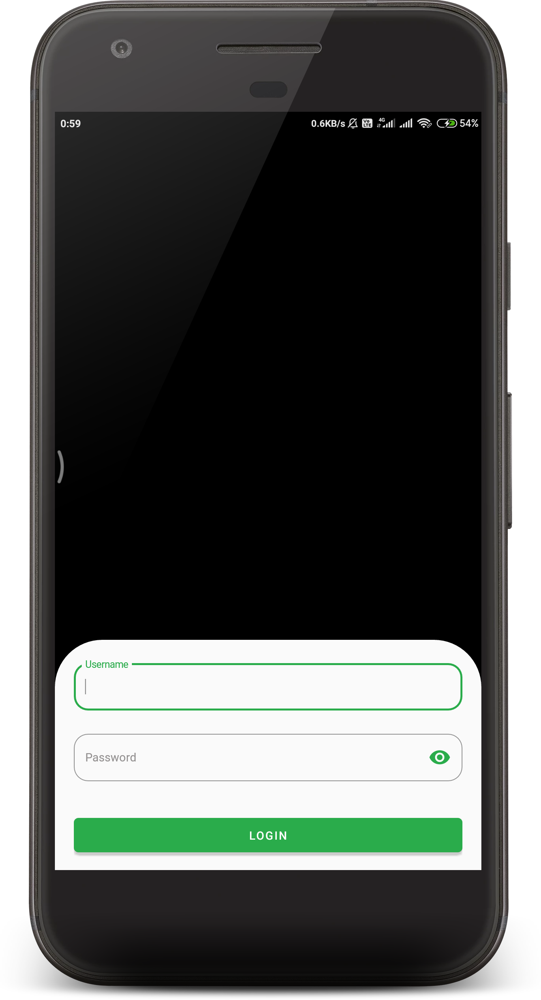
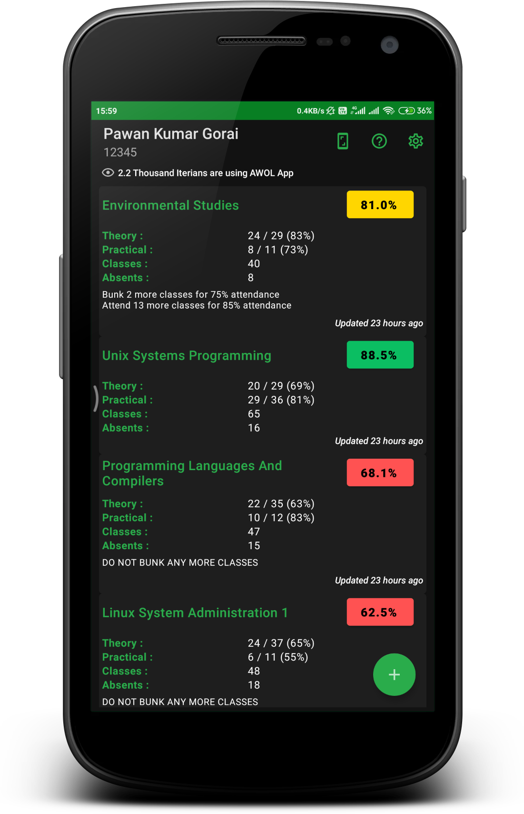
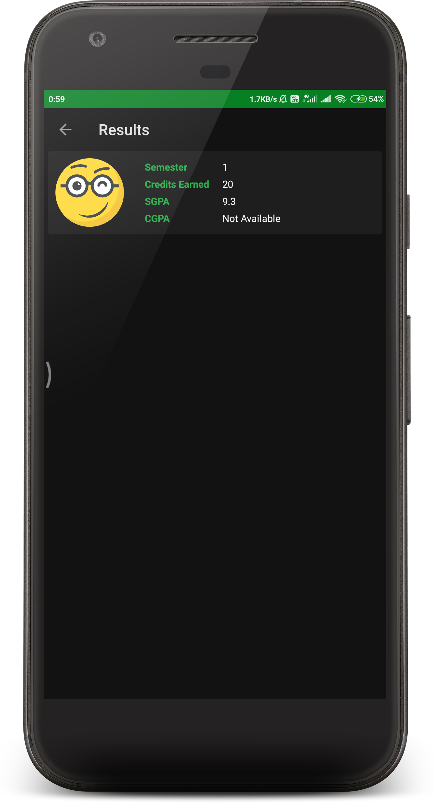
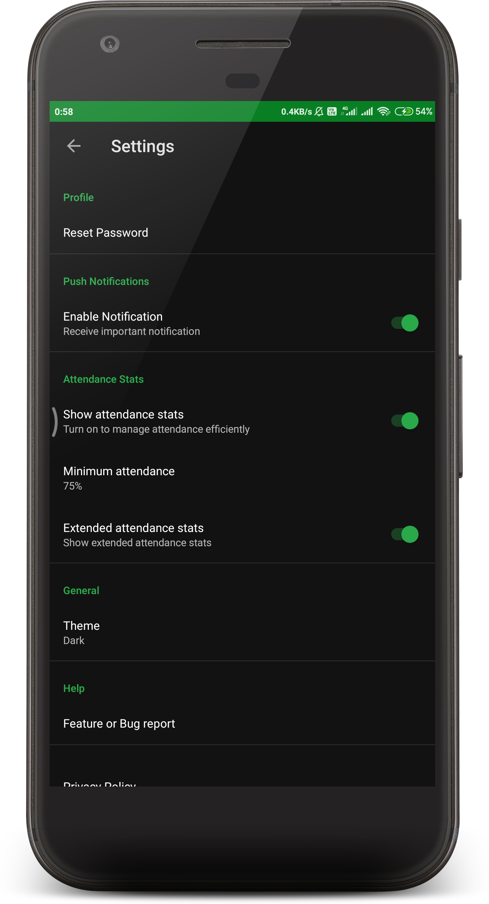

# AWOL
(Attendance Without leave)
Shows current attendance

New update contains video lectures of your subjects and themes


## Login


## Attendance


## Result


## Setting


Test server credentials:

```
Username: 12345
Password: 12345
```
